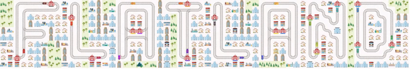

# Flatland: Multi-Agent Reinforcement Learning on Trains

Workshop @ TheWebConference 2021

## Links

* [Challenge page](https://www.aicrowd.com/challenges/flatland-workshop)
* [Conference website](https://www2021.thewebconf.org/)
* [MiTeam Room](https://theweb.miteam.eu/asset/RFce4ncN3cPJFaMp3)

## Presentations
* [00 - Introduction](https://docs.google.com/presentation/d/16bGGxfkHpPZ8YtPuXjtM1y8KOQ0o_VS2n9F7SGyi1p4/edit?usp=sharing)
* [01 - What is RL?](https://docs.google.com/presentation/d/1CPUG6biO06g793xCud1i-QTO64gI6m9udvU_Pb3OfHg/edit#slide=id.g7d852a39c0_0_454)
* [02 - The Flatland environment](https://docs.google.com/presentation/d/1Bq6j4bSlfktQ6KbMU0MvmPzNRapQM-jCVvOP_RSQgtE/edit#slide=id.gb42e0f489e_0_13)
* [03 - DQN intro](https://docs.google.com/presentation/d/11aWCW0kl5U-44yHUt_8oU21KmHFHM-785qJVhZbvhkE/edit#slide=id.g7d863decb1_0_52)
* [04 - Submitting to AIcrowd](https://docs.google.com/presentation/d/1a0WKK_DYjaaV5Vd9IznTg3WOiDU9JuCqiSNkK-7m9UY/edit?usp=sharing)
* [05 - Curiosity](https://docs.google.com/presentation/d/1ukf4_qOML23j0ddhRjoBzylf_Qdkb1UsaTc43O3Pzmw/edit?ts=604f8341#slide=id.p)
* [06 - Other challenges on AIcrowd](https://docs.google.com/presentation/d/1S2OArWZuRhrPLJahLP287KHda-0c1REgU-lJs_NWmic/edit?usp=sharing)

## Notebooks
* [02 - Introduction to Flatland](https://colab.research.google.com/github/YanickSchraner/rl-on-trains-workshop/blob/main/01_Intro_to_environment.ipynb#scrollTo=npZGvYgxIYkP)
* [03 - Introduction to DQN](https://colab.research.google.com/drive/1dL2CkEF-jDegJWSmKjymgURlHF0H41YM?usp=sharing)
* [05 - Curiosity](https://colab.research.google.com/github/YanickSchraner/rl-on-trains-workshop/blob/main/04_curiosity.ipynb)
